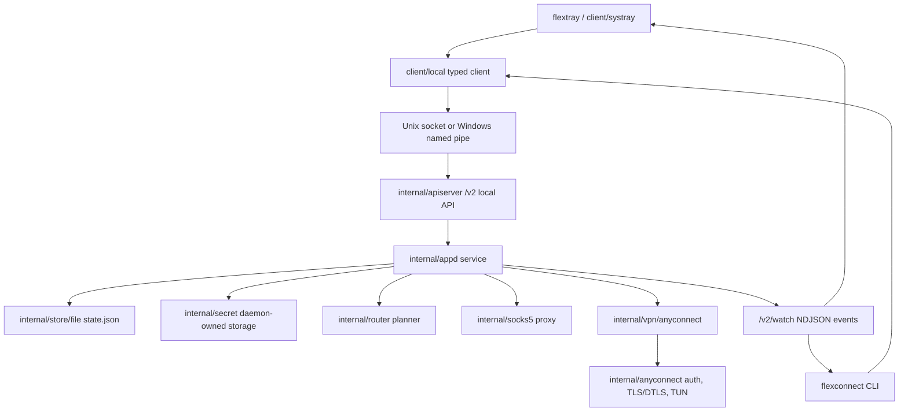

# Project Overview
FlexConnect is a Go-based, cross-platform AnyConnect client modeled after the
Tailscale client shape: a privileged local daemon owns VPN state, while a CLI,
desktop tray and typed local API client provide user control.
Its pitch is a single local control plane for profiles, routing, diagnostics,
SOCKS5 proxying, and real AnyConnect password-auth sessions.

## Repository Structure
- `assets/` contains application icons and Windows runtime assets.
  - `icons/` embeds tray, favicon, and logo assets into Go binaries.
  - `windows/` holds Windows-specific assets such as the tray icon and Wintun DLL.
- `client/` contains user-facing clients for the daemon.
  - `local/` is the typed HTTP-over-local-IPC API client.
  - `systray/` builds the desktop tray menu and daemon event watcher.
- `cmd/` contains Go command entry points.
  - `flexconnect/` is the CLI.
  - `flexconnectd/` is the daemon.
  - `flextray/` is the tray process.
  - `dist/` builds release artifacts across Linux, Windows, and macOS.
- `dist/` is generated packaging output and should not be treated as source.
- `docs/` contains project audit and acceptance notes.
- `internal/` contains daemon, API, VPN, routing, IPC, storage, logging, and type code.
  - `anyconnect/` is the embedded AnyConnect protocol, tunnel, TUN, and auth stack.
  - `netcheck/` owns the CLI connection probe: CSTP/DTLS authentication, user-space traffic
    probing without an OS TUN, bounded download measurement, and sanitized results.
  - `apiserver/` exposes the local `/v2` control API.
  - `appd/` owns profiles, connection state, notifications, health, operations, and proxy state.
  - `ipc/` abstracts Unix sockets and Windows named pipes.
  - `router/` plans effective routes from server routes and profile overrides.
  - `secret/` stores passwords through daemon-owned files on Linux, the OS keyring, or an in-memory test store.
  - `store/file/` persists non-secret profile state as JSON.
  - `vpn/` defines the backend interface and the AnyConnect adapter.
- `release/` contains packaging metadata, lifecycle scripts, and release target assets.
- `scripts/` contains build, packaging, and install scripts.
  - `launchd/` contains the macOS daemon plist.
  - `systemd/` contains the Linux daemon service unit.
- `tmp/` is local temporary output and should not be treated as source.
- `.env` is a local netcheck credential file and is ignored by Git.
- `Dockerfile` builds the Linux container image for `flexconnectd` and `flexconnect`.
- `docker-compose.example.yml` documents Linux TUN, SOCKS5 port, state volume, and Docker secret wiring.
- `.dockerignore` excludes local secrets, build outputs, runtime state, caches, and local worktrees from Docker build context.
- `.gitignore` defines ignored secrets, build outputs, runtime state, and caches.
- `go.mod` and `go.sum` define the Go module and locked dependencies.
- `README.md` is the primary user-facing quick start and validation guide.

## Build & Development Commands
Install or refresh Go modules:

```powershell
go mod download
```

Run the daemon and tray during development:

```powershell
go run .\cmd\flexconnectd
go run .\cmd\flextray
```

Run the CLI from source:

```powershell
go run .\cmd\flexconnect status
go run .\cmd\flexconnect login
go run .\cmd\flexconnect control-mode user
```

Build all Go packages:

```powershell
go build ./...
```

Build and verify the Linux Docker image:

```bash
docker build -t flexconnect:local .
docker run --rm -e FLEXCONNECT_CONNECT_ON_START=false flexconnect:local -h
```

Run the Docker Compose example with a relative Docker secret file:

```bash
mkdir -p secrets
printf '%s\n' '<password>' > secrets/flexconnect_password
FLEXCONNECT_SERVER=https://vpn.example.com FLEXCONNECT_USERNAME=alice docker compose -f docker-compose.example.yml up --build
```

Publish Linux container image to GitHub Packages (GHCR):

```bash
echo "$GITHUB_TOKEN" | docker login ghcr.io -u "$GITHUB_ACTOR" --password-stdin
IMAGE=ghcr.io/<OWNER>/flexconnect
VERSION=<VERSION>

docker build -t "${IMAGE}:${VERSION}" .
docker push "${IMAGE}:${VERSION}"
docker tag "${IMAGE}:${VERSION}" "${IMAGE}:latest"
docker push "${IMAGE}:latest"
```

Manual workflow dispatch (optional):

```bash
gh workflow run docker-release.yml -f image-tag=1.3.3
```

Build distribution artifacts through the unified dist entrypoint:

```powershell
go run .\cmd\dist list
go run .\cmd\dist build --version 1.3.3 linux/amd64/tgz
go run .\cmd\dist build --version 1.3.3 linux/amd64/deb
go run .\cmd\dist build --version 1.3.3 linux/amd64/rpm
go run .\cmd\dist build --version 1.3.3 windows/amd64/zip
go run .\cmd\dist build --version 1.3.3 windows/amd64/msi
go run .\cmd\dist build --version 1.3.3 darwin/amd64/pkg
go run .\cmd\dist build --version 1.3.3 darwin/arm64/pkg
```

Install or remove the Windows service:

```powershell
.\scripts\install-windows-service.ps1
.\scripts\uninstall-windows-service.ps1
```

Install Linux or macOS service templates after building binaries into `bin/`:

```bash
./scripts/install-linux.sh
./scripts/install-macos.sh
```

Run unit and integration tests:

```powershell
go test ./...
```

Format only touched Go files:

```powershell
gofmt -w .\path\to\touched_file.go
```

Lint:

```powershell
go vet ./...
```

Type-check:

```powershell
go test ./...
```

Debug daemon and CLI calls with verbose logging:

```powershell
go run .\cmd\flexconnectd -v
go run .\cmd\flexconnect -v status
```

Deploy:

Container deployment can be done via GitHub Container Registry when pushing `v*` tags:

- Build artifacts are produced by the existing `release` workflow.
- Linux container images are built and published by `.github/workflows/docker-release.yml` to `ghcr.io`.

## Code Style & Conventions
- Use Go 1.26.2 as declared in `go.mod`.
- Run `gofmt` on touched Go files; avoid repo-wide formatting churn unless requested.
- Keep package names lower-case and aligned with their directories.
- Put command entry points in `cmd/<binary>` and reusable code in `client/` or `internal/`.
- Use `UpperCamelCase` for exported Go identifiers and `lowerCamelCase` for unexported ones.
- Keep JSON field names in `snake_case` to match `internal/types`.
- Prefer typed structs in `internal/types` over ad hoc maps for local API payloads.
- Pass `context.Context` through daemon, client, backend, and long-running operations.
- Store non-secret profile metadata through `internal/store/file`; store passwords only through
  `internal/secret`.
- Use fake VPN backends, memory secret stores, and temp state paths in tests.
- Existing logging is component-based through `internal/logging`; keep new logs concise and
  avoid passwords, tokens, and full credential-bearing URLs.
- CI uses `go vet ./...`; no additional repo-owned linter is configured.

## Architecture Notes


The daemon `flexconnectd` listens on a platform-specific local IPC endpoint and serves the
`internal/apiserver` HTTP API over that socket or named pipe. The CLI and tray both use
`client/local`, so control commands, profile edits, status reads, diagnostics, and event watches
share one typed client path. `internal/appd` is the stateful coordinator: it loads and persists
profiles, stores passwords through the selected secret backend, starts and stops the VPN backend, computes
effective routes, manages the optional SOCKS5 listener, and emits
watch notifications. The AnyConnect adapter configures the embedded protocol stack, performs
password auth, establishes TLS/DTLS and TUN state, then reports session details back to the daemon.

`flexconnect netcheck` is the explicit no-OS-TUN diagnostic path. It owns a connection-local auth
client and session, performs CSTP/DTLS observation and an optional bounded HTTP download through
the user-space stack, and prints only sanitized socket, underlay, transport, and throughput data.
The removed `flexconnect-probe` entry point and old package-global auth/session APIs must not be
reintroduced.

Connection lifecycle observability is owned by the daemon: AnyConnect records
the first terminal close reason on each session and emits it with the stable
connection ID. The daemon publishes bounded in-memory lifecycle history through
`/v2/watch` and `/v2/diagnostics`; the tray consumes these events for
cross-platform desktop notifications. Manual disconnects are explicitly
classified and do not enter the unexpected-disconnect notification path. Automatic
reconnect uses exponential backoff and stops after 3 failed attempts with a
`reconnect_exhausted` lifecycle event; a manual connect starts a fresh attempt cycle.
`local_requested` closes are intentional and never enter automatic reconnect. An active
network-repair transaction exclusively owns its teardown and replacement connection, so
the generic reconnect scheduler must not run concurrently with it.

On Linux the packaged daemon runs as `root:flexconnect`; systemd owns `/run/flexconnect` and
`/var/lib/flexconnect`, and the control socket is `0660`. Only users explicitly added to the
`flexconnect` group may use the CLI or tray control plane.

Daemon-backed CLI commands perform bounded `/v2/live` and `/v2/ready` API/capability handshakes
before their command request. Read-only diagnostics, disconnect, and administrator `control-mode`
recovery remain available while readiness is false. Interactive input is collected outside request deadlines; ordinary
commands and VPN connection commands use separate configurable timeouts.

## Testing Strategy
- Unit tests cover routing, logging, file storage, CLI behavior, tray helpers, and the AnyConnect
  backend adapter.
- Integration tests in `internal/apiserver` and `internal/appd` exercise the local API, daemon
  state transitions, diagnostics, profile CRUD, route replay, and fake backend events.
- Docker verification builds the Linux image and runs `flexconnectd -h` with
  `FLEXCONNECT_CONNECT_ON_START=false`.
- Local default:

```powershell
go test ./...
```

- CI runs tests, race-sensitive package matrices, vet, builds, packaging, and Docker builds on
  the supported operating systems. It does not perform a real VPN or independent security scan.

## Security & Compliance
- `.env`, `.env.*`, generated diagnostics, state files, logs, binaries, installers, and temp
  outputs are ignored by `.gitignore`; do not commit them.
- Passwords are stored through `internal/secret`: Linux defaults to daemon-owned `file` storage;
  Windows/macOS default to the OS keyring; tests use memory storage.
- Explicit `FLEXCONNECT_SECRET_STORE=keyring` fails startup when the OS keyring is unavailable;
  it must never fall back automatically. `file` stores a `0600` plaintext JSON file in a `0700`
  directory with platform-appropriate restrictive permissions; it does not encrypt secrets.
  Existing keyring credentials are not automatically migrated when changing backends.
- Docker defaults `FLEXCONNECT_SECRET_STORE=memory`; secrets are injected from
  `FLEXCONNECT_PASSWORD` or `FLEXCONNECT_PASSWORD_FILE`, and both set together must fail fast.
- Profile state persists only metadata and `secret_ref` values, not raw passwords.
- Diagnostics are tested to avoid raw password leakage; keep that invariant for new fields.
- Local control traffic is served over a `0660 root:flexconnect` Unix socket on Linux or a protected Windows named pipe, not a public TCP port.
- Docker exposes only the SOCKS5 listener by default. Do not expose the local control socket over
  TCP as part of Docker work.
- Windows daemon startup may request elevation; service install scripts modify system services.
- Dependency scanning is not configured in the repository.
- `cmd/dist` package metadata and the root `LICENSE` identify the project as proprietary.

## Agent Guardrails
- Do not read, print, commit, or modify `.env`, `.env.*`, generated diagnostics, or user state
  files unless the user explicitly asks.
- Do not edit generated outputs under `bin/`, `dist/`, `tmp/`, installer artifacts, or compiled
  binaries except as part of an explicit packaging task.
- Do not replace `assets/windows/wintun.dll` without a reviewed upstream provenance note.
- Do not run service install or uninstall scripts without explicit user approval; they require
  administrator or root privileges and modify host services.
- Do not print Docker secret contents, password environment values, generated state files, or
  credential-bearing Compose overrides.
- Changes to auth, secret storage, diagnostics, routing, TUN, service scripts, installers, and
  package metadata require human review.
- Keep new daemon, tray, and CLI operations bounded with contexts or cancellation paths.
- Prefer `/v2/watch` for UI updates instead of adding tight polling loops.
- Only change `go.mod` or `go.sum` when intentionally adding, removing, or upgrading dependencies.
- Preserve existing build and packaging commands unless the user asks to change them.
- If adding nested `AGENTS.md` files, make their scope explicit and keep overrides narrower than
  this root guide.

Automatic VPN reconnect is limited to 3 classified transient failures with exponential backoff.
Watch clients reconnect through epoch/revision replay rather than polling. Update checks run no more
often than the configured interval (6 hours by default). New background clients must define a
bounded timeout, cancellation path, maximum retries, and observable terminal failure before merge.

## Extensibility Hooks
- Add VPN providers by implementing `internal/vpn.Backend` and wiring the backend in
  `cmd/flexconnectd/newService`.
- Customize route behavior by implementing `internal/router.Planner` and injecting it into
  `appd.New`.
- Swap state persistence by implementing the `appd.Store` interface used by `internal/appd`.
- Swap secret persistence by implementing `internal/secret.Store`.
- Extend the local API by updating `internal/types`, `internal/apiserver`, `client/local`, and then
  the CLI or tray callers.
- Add CLI commands under `cmd/flexconnect` and keep help text in sync with behavior.
- Add tray behavior in `client/systray`, using existing status, diagnostics, and watch flows.
- Add package formats or install behavior through `cmd/dist`, `release/dist`, `scripts/`, and `release/`.
- Useful flags and environment variables:
  - `--socket` selects the daemon socket or named pipe for daemon, CLI, and tray.
  - `--state` selects the daemon state file.
  - `-v` and `--verbose` enable debug logging for daemon and CLI.
  - `FLEXCONNECTD_NO_ELEVATE=1` disables Windows daemon auto-elevation.
  - `FLEXCONNECT_SOCKET` selects the daemon Unix socket or named pipe through environment.
  - `FLEXCONNECT_STATE` selects the daemon state file through environment.
  - `FLEXCONNECT_VERBOSE=true` enables debug logging through environment.
  - `FLEXCONNECT_SECRET_STORE=keyring|file|memory` selects password persistence; Linux defaults to
    `file`, Windows/macOS to `keyring`. Explicit keyring mode fails if unavailable.
  - `FLEXCONNECT_CONNECT_ON_START=true` creates or updates the startup profile and connects during daemon startup.
  - `FLEXCONNECT_CONNECT_TIMEOUT` bounds startup connection attempts, for example `45s`.
  - `FLEXCONNECT_PROFILE_NAME` identifies the env-managed machine profile; the daemon generates its ID.
  - `FLEXCONNECT_SERVER`, `FLEXCONNECT_USERNAME`, and optional `FLEXCONNECT_GROUP` configure AnyConnect login.
  - `FLEXCONNECT_PASSWORD` and `FLEXCONNECT_PASSWORD_FILE` are mutually exclusive password inputs.
  - `FLEXCONNECT_ACCEPT_SERVER_ROUTES`, `FLEXCONNECT_AUTO_RECONNECT`, `FLEXCONNECT_APPLY_DNS`, and `FLEXCONNECT_MTU` configure profile runtime behavior.
  - `FLEXCONNECT_DNS`, `FLEXCONNECT_INCLUDE_ROUTES`, and `FLEXCONNECT_EXCLUDE_ROUTES` are comma-separated profile lists.
  - `FLEXCONNECT_SOCKS5_ENABLED` and `FLEXCONNECT_SOCKS5_LISTEN` configure the built-in VPN-only SOCKS5 listener.
  - `--version` and `--out` customize `cmd/dist build` output.
  - `SYSTEMD_DIR` and `PLIST_TARGET` customize install locations.

No generic feature-flag system exists; add runtime toggles only with a concrete product requirement
and an explicit default, owner, removal condition, and test matrix.

## Further Reading
- [README.md](README.md)
- [Architecture](docs/ARCH.md)
- [Tailscale comparison audit](docs/tailscale-comparison-audit-2026-08-29.md)
- [assets/icons/README.md](assets/icons/README.md)
- [scripts/systemd/flexconnectd.service](scripts/systemd/flexconnectd.service)
- [launchd plist](scripts/launchd/com.flexconnect.flexconnectd.plist)

Add an ADR under `docs/` when a future change alters the v2 API contract, state schema, identity
model, network ownership transaction, or supported platform integration.
